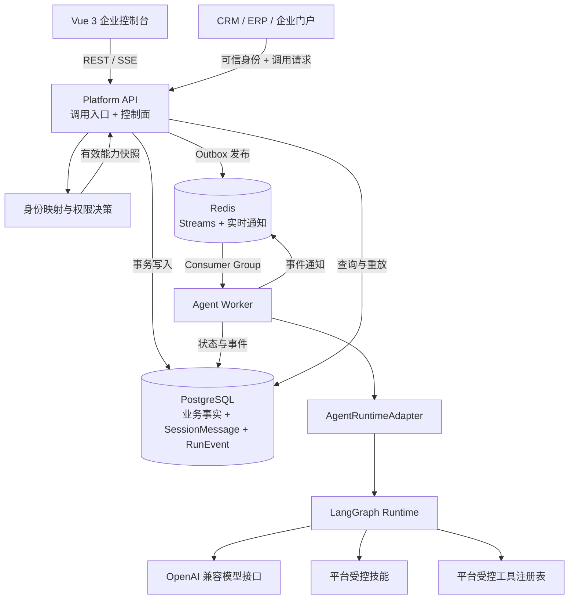
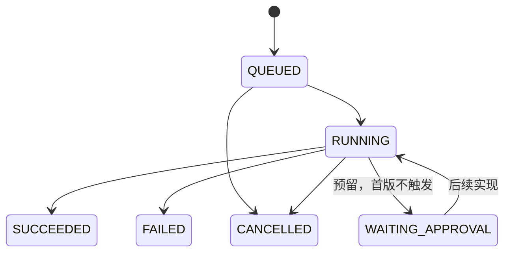

# AgentPlane 企业级智能体平台架构与第一版实施规划

> 文档状态：首版规划与实现基线
> 更新日期：2026-08-06
> 当前阶段：第一版可运行骨架已实现，进入本地验收
> 适用范围：AgentPlane 第一版可运行骨架及后续演进

## 1. 文档目的

本文档记录 AgentPlane 从产品定位、架构原则、技术选型到第一版实施边界的完整规划，作为后续开发、评审、测试和演进的共同依据。

AgentPlane 的目标不是再实现一个普通聊天页面，而是建立一个统一管理企业 Agent、技能、工具、权限和调用记录的平台。第一版必须形成真实可运行闭环，同时避免过早引入完整微服务、多级调度、复杂权限和生产级基础设施。第一版完成后，项目优先补齐企业应用接入和治理闭环，鲁棒性、容灾和生产加固在出现明确使用需求后再按风险补齐。

第一版目标链路如下：

```text
创建 Agent 草稿
    ↓
发布不可变 Agent 版本
    ↓
创建并固定版本的 Session
    ↓
创建独立 TaskRun
    ↓
Redis Streams 调度
    ↓
Agent Worker 执行 LangGraph
    ↓
持久化运行事件并通过 SSE 展示
    ↓
Run 成功、失败或取消
```

该链路用于验证平台自身的运行能力。后续主要使用入口是 CRM、ERP、门户等企业应用，内置聊天页面主要承担调试、演示和验收作用。

## 2. 平台定位

AgentPlane 定位为可逐步演进的企业级智能体控制与运行平台，最终用于统一管理：

- 智能体定义、配置、版本和发布；
- 可复用技能的定义、版本、绑定和授权；
- 模型及模型调用策略；
- 工具、连接器和企业系统访问；
- 用户、租户、权限与数据隔离；
- CRM、ERP、门户等调用应用及其可信身份；
- 同步、异步、长流程、审批和重试任务；
- Worker 调度、限流、成本与故障恢复；
- 运行事件、审计、Tracing、指标和告警；
- 托管智能体与外部智能体代理接入。

第一版不是上述能力的完整实现，而是建立不会阻碍后续扩展的骨架。

平台面向两类主要使用者：管理员在控制台配置 Agent、技能、工具和权限；企业应用通过统一调用接口代表当前登录用户发起请求并接收运行结果。平台负责验证调用方和用户身份，计算本次运行的有效能力并保存审计记录。

### 2.1 多人并发的核心模型

企业多人使用同一个 Agent 时，不为每个用户复制一套 Agent 定义。正确模型是共享配置、隔离状态、独立执行：

```text
一个 AgentDefinition / AgentVersion
            │
            ├── 用户 A / Session A / Run A
            ├── 用户 B / Session B / Run B
            └── 用户 C / Session C / Run C
                              │
                              ▼
                       Worker 集群并行执行
```

各概念职责如下：

| 概念 | 作用 | 并发关系 |
|---|---|---|
| AgentDefinition | 保存可编辑草稿和当前配置 | 多用户共享 |
| AgentVersion | 保存一次不可变发布快照 | 多个 Session 可引用 |
| Session | 隔离某个用户的一条对话线程 | 用户可拥有多个 |
| TaskRun | 表示一次独立执行 | 每次请求创建一个 |
| Worker | 实际执行 Run | 根据负载横向扩容 |
| 子 Agent | 处理业务专业分工 | 不用于解决基础并发 |

多 Agent 是业务编排问题，高并发是任务隔离、队列、Worker 和配额问题，二者不能混为一谈。

### 2.2 外部接入边界

后续演进需要明确区分三类接入：

- **调用应用**：CRM、ERP、门户等业务系统调用 AgentPlane 中托管的 Agent；
- **工具与连接器**：AgentPlane 中的 Agent 查询或操作外部企业系统；
- **外部 Agent**：AgentPlane 代理其他平台托管的 Agent。

调用应用不能通过普通请求头直接声明任意用户 ID。正式接入应验证应用凭据和短期用户身份声明，再映射到平台租户与用户权限。

## 3. 总体架构原则

第一版遵循以下原则：

1. **架构先分层，部署先合并**：代码保留控制面、数据面和执行面边界，但先使用模块化单体 API 和独立 Worker。
2. **接口先抽象，能力后扩展**：Agent、模型、工具和外部运行时均通过平台接口访问，不让某个框架类型泄漏到公共 API。
3. **数据库保存事实，Redis 负责传递**：PostgreSQL 是任务状态和审计事件的最终事实来源，Redis 不承担长期业务真相。
4. **共享 Agent 配置，隔离 Session 和 Run**：所有业务数据从第一天携带 `tenant_id`，每个 Run 拥有独立状态和日志。
5. **API 和 Worker 独立扩容**：HTTP 并发与 Agent 执行并发分开治理，禁止在 FastAPI 请求进程中直接执行长任务。
6. **已发布版本不可修改**：运行必须引用明确版本，保证审计和复现。
7. **企业写操作默认受控**：第一版不开放任意 Shell、代码执行、文件写入或外部企业系统写操作。
8. **首版形成闭环但不追求生产部署**：实现可靠的开发态垂直切片，不引入 Kubernetes、Kafka 或完整服务网格。
9. **后续功能优先、鲁棒性后置**：优先实现可验收的业务能力；高可用、自动恢复、复杂重试和性能加固必须由真实场景驱动，不提前占用主要开发资源。租户隔离、权限边界、数据一致性和不可逆操作保护仍是不能后置的底线。

## 4. 逻辑架构



### 4.1 首版部署组件

| 组件 | 首版形态 | 主要职责 |
|---|---|---|
| `platform-web` | 本地 Vite 开发服务 | Agent 与权限管理、运行调试、Run 详情 |
| `platform-api` | 本地 FastAPI 进程 | 身份、租户、Agent、Session、Run、SSE、Outbox |
| `agent-worker` | 本地独立 Python 进程 | 消费任务、运行 Agent、保存事件 |
| PostgreSQL | Docker Compose | 业务数据、会话消息、事件、Outbox |
| Redis | Docker Compose | Run 调度、Consumer Group、事件唤醒 |

应用在第一版不放进容器，PostgreSQL 和 Redis 通过 Compose 启动，以保留本地热更新和调试效率。

## 5. 技术选型

### 5.1 后端

主选技术：

- Python 3.13；
- FastAPI；
- Pydantic 2；
- SQLAlchemy 2 异步模式；
- Alembic；
- PostgreSQL；
- Redis Streams；
- Uvicorn；
- psycopg 3；
- OpenTelemetry 预留集成。

选择 FastAPI 的主要原因：

- 与 LangGraph、模型 SDK、MCP 和 AI 生态直接衔接；
- API 与 Worker 可以共享 DTO、运行时适配器和工具契约；
- Agent 场景主要等待模型、数据库和外部 API，适合异步 I/O；
- API 和 Worker 仍可作为独立进程分别扩容。

首版不选择 NestJS，是为了避免控制面 TypeScript 与 Python Agent Worker 形成双语言业务核心；不选择 Spring Boot 或 ASP.NET Core，是因为当前没有企业强制 Java/.NET 或特定云平台约束。

如果未来组织明确以 Java 为主，可将控制面迁移到 Spring Boot，并保留 Python Worker；如果明确采用 Azure/.NET，可重新评估 ASP.NET Core 与 Microsoft Agent Framework。

### 5.2 前端

主选技术：

- Vue 3；
- TypeScript；
- Vite；
- Vue Router；
- Pinia；
- Element Plus；
- Vitest；
- Playwright；
- pnpm。

首版是登录后的企业管理控制台，不需要 SSR，因此不引入 Nuxt 或 Next.js。Pinia 只保存身份、导航和局部 UI 状态，服务端业务数据通过独立 API 层管理。

### 5.3 Agent 框架

第一种托管运行时选择 LangGraph 1.x，首版可使用 LangChain `create_agent` 快速建立 Agent 循环，在需要明确审批、分支或固定业务流程时再逐步使用 LangGraph Graph API。

LangGraph 在 AgentPlane 中只是运行时实现，不是平台领域模型。平台通过以下抽象隔离框架：

```text
AgentRuntimeAdapter
├── validate_definition()
├── start_run()
├── resume_run()
├── cancel_run()
└── stream_events()
```

首版实现：

```text
LangGraphRuntimeAdapter
```

后续可扩展：

```text
OpenAIAgentsRuntimeAdapter
GoogleAdkRuntimeAdapter
MicrosoftAgentFrameworkAdapter
ExternalAgentProxyAdapter
```

OpenAI Agents SDK 适合作为第二运行时适配器，其 Agent loop、Session、Tracing、Guardrail、Handoff 和可恢复审批能力较完整；Google ADK 和 Microsoft Agent Framework 分别作为 GCP 与 Azure/.NET 路线的条件选项。

### 5.4 辅助工程栈

| 类别 | 技术 | 规则 |
|---|---|---|
| 源码管理 | Git | 单仓库；初始化但首轮不提交、不推送 |
| Python 管理 | uv | 管理 Python、虚拟环境、依赖和 `uv.lock` |
| 前端依赖 | pnpm | 固定 `packageManager` 并提交锁文件 |
| Python 格式与 Lint | Ruff | 不再叠加 Black、isort、Flake8 |
| Python 类型 | Pyright | 本地和检查脚本执行 |
| 后端测试 | pytest | 单元、集成和异步测试 |
| 前端测试 | Vitest、Playwright | 组件和浏览器闭环 |
| Git Hook | pre-commit | 仅执行快速静态检查 |
| 本地依赖 | Docker Compose | 只启动 PostgreSQL、Redis |
| 数据库版本 | Alembic | 所有结构变化通过 migration |
| API 契约 | OpenAPI 类型生成 | 前后端类型不手工复制 |
| 可观测性 | JSON 日志、OpenTelemetry | 从第一天保留 Trace 上下文 |

第一版不启用 uv workspace。API 和 Worker 位于一个 Python 包中，通过两个启动入口运行；只有当运行时适配器或连接器需要成为独立包时，才拆成 uv workspace 成员。

## 6. 第一版业务范围

### 6.1 Agent 管理

Agent 草稿包含：

- 名称；
- 说明；
- 系统指令；
- 模型别名；
- 启用的工具键；
- 生命周期状态；
- 租户及审计字段。

发布时创建不可变 `AgentVersion` 快照并递增版本号。修改草稿不会影响已发布版本，已发布版本不能原地编辑。

### 6.2 Session

创建 Session 时必须选择已经发布的 Agent，并固定当时的 `agent_version_id`。后续发布新版本不改变已有 Session。

首版同一 Session 只允许一个非终态 Run，以保证消息顺序和交互状态简单明确。需要并行任务时应创建不同 Session；未来有明确业务需求时再设计会话分支。

### 6.3 TaskRun

首版状态机：



运行引用明确的 Tenant、User、Session、AgentDefinition 和 AgentVersion，并记录：

- 输入和最终输出；
- 当前状态；
- 错误码和错误摘要；
- 创建、开始、完成和取消时间；
- 模型、Token 和成本预留字段；
- Trace ID 和重试次数。

取消采用协作式取消：排队任务可直接取消；运行任务在模型或工具步骤边界检查取消标记，不强制终止进程。

### 6.4 Approval 预留

第一版不实现审批页面和暂停恢复闭环，但保留：

- `WAITING_APPROVAL` 状态；
- Approval 数据模型；
- `ApprovalRequest` 类型；
- Runtime `resume_run()` 接口；
- RunEvent 中的审批事件扩展位置。

首版不会暴露一个只能返回 `501` 的公开审批端点；正式实现审批能力时再发布 REST 契约。

### 6.5 工具

首版只提供代码注册的安全演示工具：

```text
calculator.add(a, b)
```

该工具用于验证结构化工具调用、事件记录和前端展示，不访问外部系统，也不产生不可逆副作用。

首版明确不提供：

- 任意 Shell 或 PowerShell；
- 任意 Python/JavaScript 执行；
- 文件写入和删除；
- 浏览器自动操作；
- 任意数据库 SQL；
- 企业系统写操作；
- 客户端指定本地工作目录或 MCP 服务器。

## 7. 数据模型

第一版核心表如下：

| 数据实体 | 用途 | 关键约束 |
|---|---|---|
| Tenant | 开发租户和未来租户管理基础 | 首版迁移写入固定开发租户 |
| AppUser | 记录登录用户、角色、状态和审计主体 | 属于一个 Tenant；登录名租户内唯一 |
| LocalCredential | 保存本地登录凭据 | 只保存 PBKDF2 摘要，不保存明文密码 |
| AuthSession | 保存本地 Cookie 会话 | 只保存随机令牌摘要，可过期、可撤销 |
| UserAgentGrant | 保存用户可使用的 Agent | 用户、Agent 和授权人必须在同一 Tenant |
| UserToolGrant | 保存用户被授予的工具 | 无授权默认无工具 |
| AgentDefinition | 保存可编辑草稿 | 所有查询按 Tenant 隔离 |
| AgentVersion | 保存发布快照 | 发布后不可修改；版本号递增 |
| Session | 保存对话线程 | 固定 AgentVersion |
| SessionMessage | 保存用户、助手和工具消息 | 按 Session 有序 |
| TaskRun | 保存一次执行和有效工具快照 | 同 Session 只允许一个非终态 Run |
| RunEvent | 保存规范化运行事件 | `run_id + sequence` 唯一 |
| RunApproval | 预留人工审批 | 首版不产生正式记录 |
| OutboxEvent | 事务任务投递 | 业务写入和待发布事件同一事务 |

`SessionMessage` 是模型会话历史的唯一事实来源。Worker 在启动新 Run 时，只按顺序加载同一 Session 中已经成功完成的用户和助手消息，再附加当前输入交给 Runtime；失败、取消和当前 Run 的消息不会作为历史重复注入。首版不启用持久化 LangGraph checkpoint，也不维护独立的运行时会话事实。

所有业务表：

- ID 使用 UUID；
- 时间统一存储 UTC；
- 包含 `tenant_id`；
- 需要审计的写入记录创建人和更新人；
- 跨租户读取统一表现为资源不存在，不能泄漏资源是否存在。

## 8. 身份与租户隔离

第一版保留两种本地身份模式，不接企业 OIDC：

```text
AUTH_MODE=dev     # 受控开发身份，兼容原有免登录开发流程
AUTH_MODE=local   # 登录名、密码和 HttpOnly Cookie 会话
DEV_TENANT_ID=<固定开发租户>
DEV_USER_ID=<固定开发用户>
```

`dev` 模式由中间件从受控环境变量注入管理员身份，不接受客户端传入任意 `tenant_id` 或 `user_id`。`local` 模式提供首次管理员初始化、普通用户注册、管理员审核启停和 Cookie 登录；普通用户只能使用管理员授予的 Agent，Agent 管理和用户授权接口仅允许管理员访问。所有身份仍固定在当前开发租户边界内。

本地密码只做满足 MVP 的基础保护：PBKDF2 摘要、随机会话令牌、HttpOnly Cookie、过期与撤销，不实现找回密码、MFA、验证码、锁定策略或生产级风控。`local` 与 `dev` 都仅用于本地或受控测试环境；未来 OIDC 只替换身份提供者，不改变服务层的角色检查、租户过滤和授权交集。

## 9. 模型接入

首版支持环境变量配置的 OpenAI 兼容接口：

```text
MODEL_BASE_URL=
MODEL_API_KEY=
MODEL_NAME=
MODEL_TIMEOUT_SECONDS=120
MODEL_MAX_CONCURRENCY=8
```

约束：

- API Key 只存在于进程环境，不入数据库、不写日志、不返回前端；
- AgentVersion 只保存模型别名，不保存密钥；
- 平台在未配置模型时仍可启动和管理 Agent；
- 创建 Run 时若模型未配置，返回稳定的 `MODEL_NOT_CONFIGURED` 错误；
- FakeModel 只在测试配置中注册，不能作为正式运行模型出现在生产配置中；
- 后续模型注册表通过别名映射到凭据引用，保持 AgentVersion 不感知具体密钥。

## 10. 任务投递与可靠性

### 10.1 Outbox

API 在同一 PostgreSQL 事务内写入：

1. `TaskRun`；
2. 用户输入消息；
3. `OutboxEvent`。

事务成功后由 API 内部的轻量 Outbox 发布循环将事件写入 Redis Stream。多个 API 实例未来可以通过数据库行锁安全竞争待发布事件。

### 10.2 Redis Streams

首版使用固定 Stream 和 Consumer Group：

```text
stream: agentplane:runs
group:  agentplane-workers
```

Stream 消息只携带查找业务记录所需的 ID，不把完整 Agent 定义、密钥或用户输入复制到 Redis。

Worker 采用至少一次消费语义：

- 收到消息后从 PostgreSQL 加载 TaskRun；
- 若任务已经终态，直接 ACK；
- 若任务可执行，设置 RUNNING 并运行；
- 状态和事件持久化成功后再 ACK；
- Worker 异常退出后通过 Pending reclaim 重新获得消息；
- reclaim 发现同一消息对应的 Run 已是 `RUNNING` 时，将其标记为 `FAILED / WORKER_INTERRUPTED` 后 ACK，由用户显式重试；首版不自动续跑或重新执行可能产生副作用的步骤。

### 10.3 RunEvent 与实时通知

数据库保存完整 RunEvent，Redis 只用于通知 SSE 连接有新事件。即使实时通知丢失，SSE 端点也能从数据库重放，不会丢失审计记录。

首版统一事件类型：

```text
run.started
model.delta
tool.started
tool.completed
run.completed
run.failed
run.cancelled
```

每个事件包含：

- 递增 sequence；
- event type；
- UTC timestamp；
- 可序列化 payload；
- run_id 和 trace_id。

## 11. API 规划

API 统一使用 `/api/v1` 前缀。

### 11.1 身份

| 方法 | 路径 | 作用 |
|---|---|---|
| GET | `/auth/bootstrap-status` | 查询是否需要初始化首个管理员 |
| POST | `/auth/bootstrap-admin` | 初始化首个本地管理员并登录 |
| POST | `/auth/register` | 注册待管理员审核的普通用户 |
| POST | `/auth/login` | 建立本地 Cookie 会话 |
| POST | `/auth/logout` | 撤销当前会话 |
| GET | `/auth/me` | 查询当前登录用户 |

### 11.2 管理员授权

| 方法 | 路径 | 作用 |
|---|---|---|
| GET | `/admin/users` | 查询当前租户用户 |
| PATCH | `/admin/users/{user_id}/status` | 审核、启用或停用用户 |
| GET | `/admin/users/{user_id}/permissions` | 查询用户 Agent 与工具授权 |
| PUT | `/admin/users/{user_id}/permissions` | 原子替换用户 Agent 与工具授权 |
| GET | `/admin/agents` | 查询管理员可配置的租户 Agent |

### 11.3 Agent

| 方法 | 路径 | 作用 |
|---|---|---|
| GET | `/agents` | 查询当前用户获授权的 Agent |
| POST | `/agents` | 创建 Agent 草稿 |
| GET | `/agents/{agent_id}` | 查询草稿及发布信息 |
| PATCH | `/agents/{agent_id}` | 修改草稿 |
| POST | `/agents/{agent_id}/publish` | 发布不可变版本 |
| GET | `/agents/{agent_id}/versions` | 查询历史版本 |
| GET | `/tools` | 查询代码注册的可用工具元数据 |

### 11.4 Session 与消息

| 方法 | 路径 | 作用 |
|---|---|---|
| GET | `/sessions` | 查询当前用户会话 |
| POST | `/sessions` | 创建并固定 AgentVersion 的会话 |
| GET | `/sessions/{session_id}` | 查询会话详情 |
| GET | `/sessions/{session_id}/messages` | 查询有序消息 |

### 11.5 Run

| 方法 | 路径 | 作用 |
|---|---|---|
| POST | `/sessions/{session_id}/runs` | 创建 Run 和用户消息 |
| GET | `/runs/{run_id}` | 查询状态和最终结果 |
| POST | `/runs/{run_id}/cancel` | 请求协作式取消 |
| GET | `/runs/{run_id}/events` | SSE 重放并订阅后续事件 |

SSE 使用事件 sequence 作为 `id`，支持 `Last-Event-ID` 断线恢复，并定期发送 keepalive。所有非成功响应使用稳定错误码和用户可理解的中文提示。

### 11.6 健康与能力

| 方法 | 路径 | 作用 |
|---|---|---|
| GET | `/health/live` | 进程存活检查 |
| GET | `/health/ready` | PostgreSQL、Redis 可用性检查 |
| GET | `/capabilities` | 模型是否配置、Runtime和工具能力 |

模型未配置不应使管理 API 失去 readiness，但能力接口必须明确返回不可执行状态。

### 11.7 企业应用调用方向

后续为 CRM、ERP、门户等业务系统提供独立于管理控制台的统一调用入口。调用请求需要携带经过验证的应用身份、当前用户身份和外部请求标识；平台完成身份映射和权限决策后再创建 Run，并支持流式返回、状态查询或异步回调。

该入口不接受客户端直接指定最终工具或技能权限。平台根据 Agent 发布版本、调用应用授权、用户授权和租户策略计算本次运行的有效能力，并保存不可变快照和允许或拒绝的决策记录。

## 12. 前端规划

### 12.1 页面

首版本地控制台提供五类中文页面：

1. **登录与注册**
   - 首次管理员初始化；
   - 普通用户注册后等待管理员审核；
   - 本地 Cookie 登录和退出。

2. **用户与权限管理**
   - 管理员审核、启用或停用用户；
   - 配置用户可用 Agent 和工具授权；
   - 明确展示 Agent 声明与用户授权取交集的规则。

3. **Agent 管理**
   - 列表、新建和编辑草稿；
   - 选择内置工具；
   - 发布版本；
   - 查看历史版本和只读快照。

4. **Agent 调试 Playground**
   - 选择已发布 Agent；
   - 创建 Session；
   - 发送消息并创建 Run；
   - SSE 增量展示输出和工具事件；
   - 显示模型未配置、连接中断和运行失败。

   该页面用于管理员和开发人员验证 Agent、工具与权限，不作为平台对企业最终用户的主要交付入口。

5. **Run 详情**
   - 当前状态、输入和最终输出；
   - 事件时间线；
   - 模型和工具调用摘要；
   - 错误摘要；
   - 取消按钮。

### 12.2 前端状态边界

Pinia 只保存：

- 当前登录身份和角色；
- 当前导航；
- 页面局部状态；
- 非敏感能力状态。

Agent、Session、Run 和 RunEvent 通过 API 层获取。不得把完整运行事件长期重复保存在多个全局 Store 中。

FastAPI OpenAPI 生成 TypeScript 类型，生成结果纳入版本管理；统一检查脚本验证生成结果未漂移。

## 13. 工程目录规划

```text
AgentPlane/
├── backend/
│   ├── pyproject.toml
│   ├── uv.lock
│   ├── alembic.ini
│   ├── migrations/
│   └── src/agentplane/
│       ├── api/
│       ├── worker/
│       ├── domain/
│       ├── runtime/
│       ├── infrastructure/
│       └── shared/
├── web/
│   ├── package.json
│   ├── pnpm-lock.yaml
│   └── src/
├── deploy/
│   └── compose.yaml
├── docs/
│   ├── architecture-and-mvp-plan.md
│   └── adr/
├── scripts/
├── .editorconfig
├── .gitattributes
├── .gitignore
├── .pre-commit-config.yaml
├── .env.example
└── README.md
```

Git 使用单仓库和简单主干开发：

```text
main
├── feat/agent-registry
├── feat/task-run
└── fix/sse-reconnect
```

首轮只初始化 Git，不创建远端、不提交、不推送。`uv.lock` 和 `pnpm-lock.yaml` 必须纳入版本管理；`.env`、`.venv`、`node_modules`、构建输出、日志和本地数据库文件必须忽略。

## 14. 可观测性

第一版不部署完整 Grafana、Loki、Tempo 集群，但从代码层保留统一日志和 Trace 上下文：

```text
tenant_id
user_id
agent_id
agent_version_id
session_id
run_id
trace_id
tool_call_id
model
token_usage
cost
```

日志输出结构化 JSON。不得记录模型 API Key、Authorization、完整数据库连接密码或其他凭据。OpenTelemetry 初始化采用可关闭适配器，未配置 Collector 时不影响本地开发。

## 15. 测试与质量门禁

### 15.1 后端单元测试

覆盖：

- Agent 发布版本不可变；
- 版本号递增；
- Session 固定已发布版本；
- 同 Session 非终态 Run 唯一；
- Run 状态迁移和取消语义；
- 不同租户数据隔离；
- 模型未配置错误；
- Runtime 和工具契约。

### 15.2 集成测试

使用 PostgreSQL 和 Redis 验证：

- Alembic migration；
- TaskRun 与 Outbox 原子写入；
- Redis Consumer Group 消费；
- 重复消息幂等；
- Pending reclaim 后诚实标记 Worker 中断失败；
- RunEvent sequence；
- SSE 历史重放和断线续传；
- Worker 完成、失败和取消路径。

### 15.3 测试专用 Agent

FakeModel 只在测试配置中启用，用于稳定验证：

- 普通文本输出；
- `calculator.add` 工具调用；
- 模型分片事件；
- Worker 完整闭环；
- 错误和取消路径。

### 15.4 前端测试

Vitest 覆盖：

- Agent 草稿和发布交互；
- 聊天消息和事件增量合并；
- Run 状态展示；
- 模型未配置和错误提示；
- SSE 重连。

Playwright 完成浏览器最小闭环。

### 15.5 平台无关检查

提供跨平台检查脚本，统一执行：

```text
uv sync --locked
ruff check
ruff format --check
pyright
pytest
pnpm install --frozen-lockfile
pnpm lint
pnpm typecheck
pnpm test
pnpm build
OpenAPI 类型漂移检查
```

Git Hook 只运行快速格式和基础 Lint，不能替代完整检查脚本。

## 16. 第一版验收标准

第一版完成需同时满足：

1. PostgreSQL 和 Redis 可通过 Compose 启动并通过健康检查；
2. Alembic 可从空数据库升级到最新版本；
3. 可以初始化管理员、注册普通用户并完成审核登录；
4. 管理员可以配置用户的 Agent 与工具授权，普通用户不能进入管理页面；
5. 可以创建 Agent 草稿并发布不可变版本；
6. 用户只能创建获授权 Agent 的 Session 和 Run；
7. Run 固定保存 `AgentVersion.tool_keys ∩ UserToolGrant` 权限快照；
8. 配置有效模型后，可以创建 Run；
9. Run 经 Redis Streams 被 Worker 消费；
10. 前端通过 SSE 观察 `QUEUED → RUNNING → SUCCEEDED` 和输出事件；
11. 工具调用可记录并展示；
12. 取消、失败和模型未配置均有稳定状态和提示；
13. 跨租户访问测试通过；
14. 后端静态检查、测试和前端构建通过；
15. OpenAPI 生成类型没有漂移。

Docker Engine 当前探测曾超时；如果 Docker Desktop 未运行，可以先完成静态和单元测试，但 PostgreSQL、Redis、Worker 和 SSE 的完整集成验收必须在 Docker Engine 可用后执行。

## 17. 明确延期的能力

第一版不实现：

- 企业 OIDC/SSO；
- 外部业务应用注册、服务间认证和外部用户映射；
- 可配置的多角色 RBAC 与 ABAC 策略（首版只有固定 `ADMIN` / `USER` 两级角色）；
- 数据权限策略引擎；
- 审批页面和审批恢复闭环；
- 模型注册与凭据管理页面；
- 工具和连接器管理页面；
- 外部 Agent 代理；
- 多 Agent 编排；
- 任意代码或本地系统执行；
- 长期记忆和向量数据库；
- 对象存储和附件；
- 复杂任务定时器和补偿事务；
- Temporal、Kafka；
- Kubernetes、Helm、Terraform；
- 服务网格和 GitOps；
- 生产部署和生产 SLA；
- Git 远端、提交、推送和具体 CI 平台接入。

## 18. 后续演进路线

后续演进的第一优先级是从本地运行闭环演进为企业应用可接入、权限可控制、调用可审计的 Agent 管理平台。默认实施顺序为“调用与治理功能实现 → 企业应用验收 → 根据真实故障和容量数据补鲁棒性”。除安全、租户隔离、数据一致性和不可逆操作保护外，不因假设中的未来规模提前引入自动恢复、复杂重试、额外中间件或分布式协调。

### 企业应用调用与权限基线

首版已经补齐“同一 Agent、不同用户具有不同工具权限”的基础闭环。采用最小权限交集模型：`AgentVersion.tool_keys` 表示 Agent 发布版本声明的能力上限，`user_tool_grants` 表示用户被授予的工具，实际可用工具为两者交集；`user_agent_grants` 另行决定用户能否看到并使用该 Agent。

交集必须由服务端在 `create_run()` 事务内计算，并写入 `TaskRun.effective_tool_keys` 作为本次 Run 的权限快照。Worker 只消费并防御性收窄该快照，不接受前端传入工具权限，也不在执行时重新读取实时授权。这样可以保证 AgentVersion 上限不被突破，并避免执行中途因授权变化产生漂移。

首版使用专用授权表，不提前泛化为通用 entitlement 模型；无授权默认无 Agent、无工具。正式接入企业应用后，权限还需要叠加调用应用授权和租户策略。技能进入平台范围后，采用与 Agent、工具一致的版本化和最小权限原则。

每次调用必须记录调用应用、当前用户、Agent 版本、有效技能和工具快照、权限决策、运行结果及关联请求标识。被拒绝的请求也需要留下审计记录，不能只依赖成功创建的 TaskRun。

后续优化继续遵循“先功能、后鲁棒性”，建议按以下顺序推进：

1. 建立调用应用注册、可信身份传递和外部用户映射；
2. 提供统一 Agent 调用接口，并让 CRM 等业务系统完成真实接入验收；
3. 补齐工具与技能管理、有效权限预览和授权审计；
4. 建设调用日志查询、失败与拒绝分析、Token 和成本统计；
5. 根据正式环境要求建设 OIDC、可配置 RBAC、会话治理和凭据轮换。

### 阶段 2：企业应用接入与治理基础

- 调用应用注册、凭据管理和服务间认证；
- 可信用户身份映射与统一 Agent 调用接口；
- OIDC、RBAC 和基础 ABAC；
- 模型注册、凭据引用和租户配额；
- 技能与工具注册、版本、风险级别和审批策略；
- 应用、用户、Agent、技能和工具的授权关系；
- 完整人工审批与恢复；
- Token、成本和调用限额；
- 调用日志、权限决策审计和基础监控页面。

### 阶段 3：多运行时和企业连接器

- OpenAI Agents SDK、Google ADK 或外部 Agent Adapter；
- MCP、OpenAPI 和企业系统连接器；
- 凭据托管、脱敏、幂等和工具级限流；
- 外部 Agent 代理与 A2A 接入；
- 连接器生命周期和版本管理。

### 阶段 4：生产级调度与部署

- 多租户公平调度；
- 优先级、模型配额和工具配额；
- Worker 自动扩缩容；
- 跨服务长流程、定时器和补偿；
- 在确有需求时引入 Temporal 或 Kafka；
- Kubernetes、Helm、IaC 和生产可观测性；
- SLA、告警、容量与灾难恢复。

## 19. 关键决策摘要

| 决策 | 当前选择 | 主要原因 |
|---|---|---|
| 架构形态 | 模块化单体 API + 独立 Worker | 首版简单，后续可拆分 |
| 后端 | FastAPI / Python 3.13 | 与 Agent 生态共享语言和类型 |
| 前端 | Vue 3 / TypeScript / Element Plus | 企业控制台开发效率高 |
| Agent Runtime | LangGraph 1.x | Agent 工具循环和流式事件能力匹配；首版不启用持久 checkpoint |
| 模型 | 环境变量配置 OpenAI 兼容接口 | 避免首版绑定单一模型厂商 |
| 队列 | Redis Streams | 首版任务调度和 Consumer Group 足够 |
| 业务事实 | PostgreSQL | 状态、审计和重放必须持久化 |
| 投递一致性 | Transactional Outbox | 避免数据库成功但任务丢失 |
| 实时协议 | SSE | 服务端单向事件足够且实现简单 |
| 身份与授权 | 本地登录 + 固定 ADMIN/USER + 用户 Agent/工具授权 | 先跑通功能闭环，暂不接 OIDC 或通用 RBAC |
| 企业应用接入 | 统一调用入口 + 可信应用与用户身份 | 由平台统一执行权限决策，业务系统不直接指定最终能力 |
| 多租户 | 固定开发租户 + 全表 tenant_id | 保留隔离边界，暂不开放租户选择 |
| 审批 | 只预留模型与接口 | 避免首版范围膨胀 |
| 启动方式 | 应用本地、基础设施 Compose | 保留热更新和调试效率 |
| CI | 平台无关检查脚本 | 当前未确定代码托管平台 |
| Git | 初始化但不提交/推送 | 先完成并确认骨架内容 |

## 20. 实施顺序

文档确认后，第一版按以下顺序实施：

1. 初始化 Git、根目录规范、uv/pnpm 和本地基础设施；
2. 建立后端配置、数据库模型、Alembic 和开发身份；
3. 实现 Agent 草稿、发布版本、Session 和基础 REST API；
4. 实现 TaskRun、Outbox、Redis Streams 和 Worker；
5. 实现 LangGraph Runtime、模型适配器和安全演示工具；
6. 实现 RunEvent、SSE 重放和协作式取消；
7. 实现 Vue 控制台三个页面和 OpenAPI 类型生成；
8. 完成单元、集成、前端和浏览器测试；
9. 执行静态检查、构建和最小闭环验收；
10. 输出已验证范围、未验证边界和下一阶段建议。

本文档是第一版实施的范围基线。后续如改变认证模式、模型来源、审批范围、部署方式或 CI 平台，应先更新本文档或新增 ADR，再修改实现。
